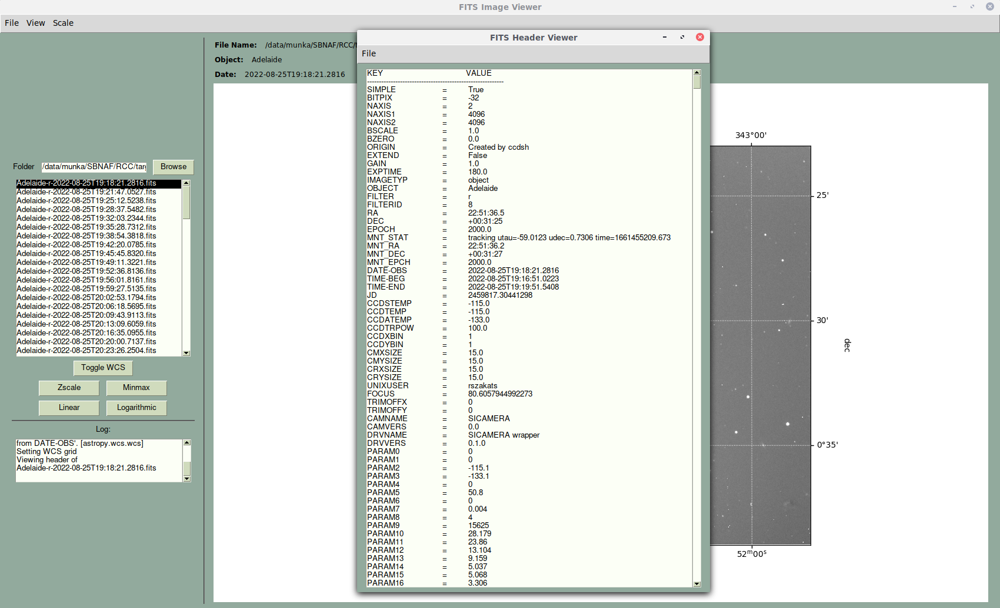

# Simple FITS Viewer
A simple fits image viewer using PySimpleGUI.

## Description
Simple FITS Viewer is a small and quick GUI program to view astronomical fits files.
It is mainly a hobby project to get some experience with PySimpleGUI.
It was inspired by the PySimpleGUI demo file, [Demo_Image_Elem_Image_Viewer_PIL_Based.py](https://github.com/PySimpleGUI/PySimpleGUI/blob/master/DemoPrograms/Demo_Image_Elem_Image_Viewer_PIL_Based.py).
The program uses the astropy package to do the necessary stretching and scaling to display the image and the WCS grid.

## Installation
No need. Download simple_fits_viewer.py and run it with python3.
```shell
$ python3 simple_fits_viewer.py
```

## Requirements

```shell
python3.*
pip3 install PySimpleGUI
pip3 install astropy
pip3 install matplotlib
```
## Features

- Can open a fit/fits file with image data.
- If WCS information is present in the header, one can toggle the WCS grid in the main window.
- Can display the header.
- Can save the header to a txt file.
- Can save the fits image to a png file.
- One can change the display scale between ZScale and MinMax.
- One can change the display stretch between Linear and Logarithmic.

## Screenshots

- Main Window

  
- Fits file opened

  
- WCS grid turned on

  
- Header is displayed

  

## Limitations

- Can't handle fits cubes.
- Only can display the first header.
- Only can save the image in png format and the text in plain text.

## Known problems

- The text file output is not "pretty".
- Can't close the main window with the File/Exit menu if header window is open.

## Author

rszakats - rszakats@konkoly.hu

## Credits

- GitHub: [PySimpleGUI](https://github.com/PySimpleGUI)
- Website: [PySimpleGUI.org](https://PySimpleGUI.org)
- [Astropy](https://www.astropy.org/)

## License

This software is licensed under the [MIT](LICENSE) License.